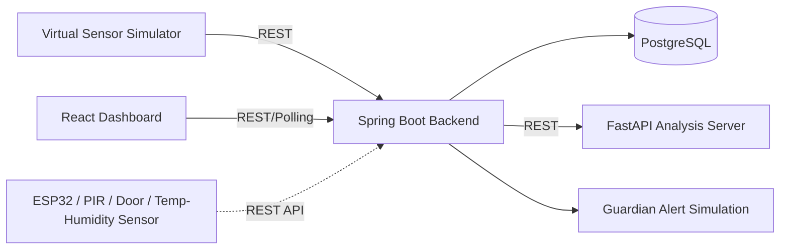

# Smart Care Lab

AI 기반 독거노인 안전 모니터링 오픈소스 플랫폼입니다. 카메라 없이 움직임, 문 열림, 온도, 습도, 조도 같은 비식별 생활패턴 데이터를 분석하여 정상, 주의, 위험 상태를 판단합니다.

실제 센서 장비가 없어도 가상 센서 시뮬레이터와 데모 시나리오 버튼으로 시연할 수 있으며, 향후 ESP32, PIR 모션센서, 문열림 센서, 온습도 센서와 쉽게 연동할 수 있는 구조로 설계했습니다.

## 기술 스택

| 영역 | 기술 |
| --- | --- |
| Frontend | React 19 + TypeScript + Vite |
| Backend | Spring Boot 4.1.0 + Java 21 |
| AI Server | Python + FastAPI |
| Database | PostgreSQL |
| Build Tool | Gradle |
| IDE | IntelliJ IDEA / VS Code |
| 형상관리 | GitHub |
| 배포 | Docker, Vercel(Frontend) |

## 사회문제 해결 포인트

독거노인의 응급상황과 고독사는 발견이 늦어질수록 피해가 커집니다. Smart Care Lab은 생활패턴 데이터 기반으로 위험 신호를 빠르게 감지하여 보호자, 복지관, 지자체 담당자가 조기에 확인할 수 있도록 돕습니다.

## 개인정보 보호 장점

- 카메라와 마이크를 사용하지 않습니다.
- 영상과 음성을 저장하지 않습니다.
- 움직임, 문 열림, 온습도, 조도 같은 비식별 데이터만 사용합니다.
- 사생활을 직접 감시하지 않고 위험 가능성만 분석합니다.

## 시스템 아키텍처



## 주요 기능

- 독거노인 등록 및 조회
- 가상 센서 데이터 생성
- 센서 데이터 저장 API
- Rule-based 위험도 분석 API
- 정상 / 주의 / 위험 상태 표시
- 위험 점수 및 판단 사유 표시
- 최근 활동 시간, 온습도, 문 열림, 움직임 상태 표시
- 최근 센서 이벤트 및 보호자 알림 이력 저장
- 정상 → 주의 → 위험 데모 시나리오 제공
- 향후 머신러닝 이상탐지 모델로 교체 가능한 AI 서버 구조

## 프로젝트 구조

```text
Smart-Care-Lab/
├─ frontend/      React 19 + TypeScript 대시보드
├─ backend/       Spring Boot 4.1.0 + Gradle 백엔드
├─ ai-server/     Python FastAPI 위험도 분석 서버
├─ simulator/     Python 가상 센서 시뮬레이터
├─ docs/          API 명세, DB 설계, 발표 문서
├─ docker-compose.yml
└─ README.md
```

## Docker 실행 방법

Docker Desktop을 실행한 뒤 프로젝트 루트에서 실행합니다.

```bash
docker compose up --build
```

접속 주소:

| 서비스 | 주소 |
| --- | --- |
| Frontend | http://localhost:3210 |
| Backend Health | http://localhost:18180/health |
| Backend API | http://localhost:18180/api/seniors |
| AI Server Docs | http://localhost:18080/docs |
| AI Server Health | http://localhost:18080/health |
| PostgreSQL | localhost:15432 |

PostgreSQL은 브라우저 접속용 포트가 아니며 DBeaver, pgAdmin 같은 DB 도구로 접속합니다.

## 로컬 개발 실행

### Frontend

```bash
cd frontend
npm install
npm run dev
```

로컬 개발 서버: http://localhost:3211

### Backend

```bash
cd backend
gradle bootRun
```

### AI Server

```bash
cd ai-server
python -m pip install -r requirements.txt
uvicorn app.main:app --reload --host 0.0.0.0 --port 18080
```

### Simulator

```bash
cd simulator
python -m pip install -r requirements.txt
python simulator.py --scenario danger
```

## 위험도 판단 기준

| 조건 | 판단 |
| --- | --- |
| 3시간 이상 움직임 없음 | 위험 점수 증가 |
| 오전 9시 이후 활동 없음 | 주의 |
| 실내온도 16도 이하 또는 32도 이상 | 위험 점수 증가 |
| 새벽 시간대 문 열림 | 이상 행동 |
| 평소 생활패턴과 다른 활동 | 이상 감지 |

위험 점수:

- 0~39점: 정상
- 40~69점: 주의
- 70점 이상: 위험

## API 목록

| Method | Path | 설명 |
| --- | --- | --- |
| GET | `/health` | 백엔드 상태 확인 |
| GET | `/api/seniors` | 독거노인 목록 조회 |
| POST | `/api/seniors` | 독거노인 등록 |
| GET | `/api/sensor-events/senior/{seniorId}` | 최근 센서 이벤트 조회 |
| POST | `/api/sensor-events` | 센서 데이터 저장 및 위험도 분석 |
| GET | `/api/dashboard/{seniorId}` | 대시보드 통합 데이터 조회 |
| GET | `/api/alerts/senior/{seniorId}` | 알림 이력 조회 |
| POST | `/api/demo/{seniorId}/{scenario}` | 데모 시나리오 생성 |
| POST | `AI Server /analyze` | 위험도 분석 |

자세한 명세는 [docs/API_SPEC.md](docs/API_SPEC.md)를 참고하세요.

## 실제 IoT 센서 연동 방법

ESP32 또는 센서 게이트웨이에서 다음 API로 JSON 데이터를 전송하면 됩니다.

```json
{
  "seniorId": 1,
  "motionDetected": true,
  "doorOpened": false,
  "temperature": 24.5,
  "humidity": 45.0,
  "illuminance": 320.0,
  "eventTime": "2026-07-01T10:30:00"
}
```

## 주요 오픈소스 사용 목록

| 라이브러리명 | 버전 | 라이선스 | 사용 목적 |
| --- | --- | --- | --- |
| React | 19.x | MIT | 프론트엔드 UI |
| Spring Boot | 4.1.0 | Apache-2.0 | 백엔드 API |
| FastAPI | 0.115.6 | MIT | AI 분석 API |
| PostgreSQL | 16 | PostgreSQL License | 데이터베이스 |
| Recharts | 2.15.x | MIT | 대시보드 차트 |
| Vite | 6.x | MIT | 프론트엔드 빌드 |
| Nginx | 1.27 | BSD-2-Clause | Docker 환경 프론트엔드 서빙 |

## 발표 데모 흐름

1. 대시보드에서 카메라 없는 비접촉 모니터링임을 설명합니다.
2. 정상 데모 버튼을 눌러 안정 상태를 보여줍니다.
3. 주의 데모 버튼을 눌러 활동 부족 상태를 보여줍니다.
4. 위험 데모 버튼을 눌러 장시간 움직임 없음, 고온, 새벽 문 열림 상태를 보여줍니다.
5. 보호자 알림 이력과 위험 판단 사유를 확인합니다.

## 향후 확장 가능성

- ESP32, PIR, 문열림, 온습도 센서 연동
- MQTT 기반 실시간 센서 수집
- 보호자 모바일 앱 푸시 알림
- 지자체 관제 대시보드
- 복지관 담당자용 위험 우선순위 큐
- 머신러닝 기반 개인별 이상탐지 모델 교체
