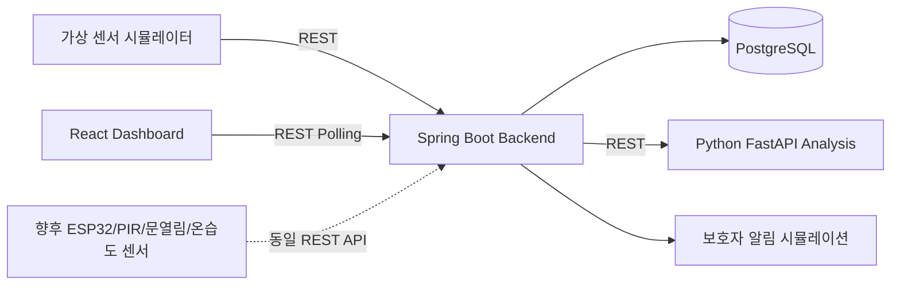

# AI 기반 독거노인 안전 모니터링 오픈소스 플랫폼

카메라 없이 생활패턴 센서 데이터만으로 독거노인의 이상 징후를 감지하는 오픈소스 안전 모니터링 플랫폼입니다. 실제 센서 장비가 없어도 가상 센서 시뮬레이터로 대시보드와 위험도 분석을 시연할 수 있으며, 향후 ESP32, PIR 모션센서, 문열림 센서, 온습도 센서, 조도 센서와 쉽게 연동할 수 있도록 REST API 기반으로 설계했습니다.

## 사회문제 해결 포인트

독거노인 고독사와 응급상황은 발견이 늦어질수록 피해가 커집니다. 이 프로젝트는 움직임 없음, 비정상적인 문 열림, 위험 온도, 평소와 다른 활동 패턴을 빠르게 분석하여 보호자나 복지 담당자가 조기에 확인할 수 있도록 돕습니다.

## 개인정보 보호 장점

- 카메라, 마이크, 영상 저장을 사용하지 않습니다.
- 움직임, 문 열림, 온습도, 조도 같은 비식별 생활 신호만 사용합니다.
- 민감한 사생활을 직접 관찰하지 않고도 위험 상태를 추정합니다.
- 지자체, 복지관, 보호자 앱으로 확장할 때도 최소 데이터 원칙을 유지할 수 있습니다.

## 시스템 아키텍처



## 주요 기능

- 독거노인 등록/조회
- 가상 센서 데이터 생성 및 저장
- 움직임, 문 열림, 온도, 습도, 조도, 마지막 활동 시간 관리
- Rule-based 위험도 분석 API
- 정상 / 주의 / 위험 상태 표시
- 위험 점수 및 판단 사유 표시
- 최근 센서 이벤트, 알림 이력, 생활패턴 차트 제공
- 보호자 알림 시뮬레이션
- 정상 → 주의 → 위험 데모 시나리오 제공

## 빠른 실행

### 1. Docker Compose 실행

```bash
docker compose up --build
```

### 2. 접속 주소

- Frontend: http://localhost:3210
- Backend API: http://localhost:18180
- Backend Health: http://localhost:18180/health
- AI Analysis API: http://localhost:18080/docs
- AI Health: http://localhost:18080/health
- PostgreSQL: localhost:15432

### 3. 데모 데이터 생성

대시보드의 `정상 데모`, `주의 데모`, `위험 데모` 버튼을 누르면 상태가 단계적으로 바뀝니다.

또는 시뮬레이터를 실행할 수 있습니다.

```bash
cd simulator
python -m pip install requests
python simulator.py --scenario danger
```

## 로컬 개발 실행

### Backend

```bash
cd backend
mvn spring-boot:run
```

### AI Server

```bash
cd ai-server
python -m pip install -r requirements.txt
uvicorn app.main:app --reload --host 0.0.0.0 --port 18080
```

### Frontend

```bash
cd frontend
npm install
npm run dev
```

## API 목록

| Method | Path | 설명 |
| --- | --- | --- |
| GET | `/api/seniors` | 독거노인 목록 조회 |
| POST | `/api/seniors` | 독거노인 등록 |
| GET | `/api/sensor-events/senior/{seniorId}` | 최근 센서 이벤트 조회 |
| POST | `/api/sensor-events` | 센서 데이터 저장 및 위험도 분석 |
| GET | `/api/dashboard/{seniorId}` | 대시보드 통합 데이터 조회 |
| GET | `/api/alerts/senior/{seniorId}` | 알림 이력 조회 |
| POST | `/api/demo/{seniorId}/{scenario}` | 데모 시나리오 생성 |
| POST | `ai-server /analyze` | 위험도 분석 |

자세한 명세는 [docs/API_SPEC.md](docs/API_SPEC.md)를 참고하세요.

## 위험도 판단 기준

- 3시간 이상 움직임 없음: 위험 점수 증가
- 오전 9시 이후 활동 없음: 주의
- 실내온도 16도 이하 또는 32도 이상: 위험 점수 증가
- 새벽 시간대 문 열림: 이상 행동
- 평소 생활패턴과 다른 활동 발생: 이상 감지

점수 기준:

- 0~39점: 정상
- 40~69점: 주의
- 70점 이상: 위험

## 실제 IoT 센서 연동 방법

ESP32 같은 장비에서 Wi-Fi 연결 후 `POST /api/sensor-events`로 JSON 데이터를 전송하면 됩니다.

```json
{
  "seniorId": 1,
  "motionDetected": true,
  "doorOpened": false,
  "temperature": 24.5,
  "humidity": 45.0,
  "illuminance": 320.0,
  "eventTime": "2026-07-01T10:30:00"
}
```

센서 종류가 늘어나도 Backend의 센서 이벤트 API는 유지하고, AI Server의 분석 모듈만 확장하면 됩니다.

## 오픈소스 확장 가능성

- 지자체 관제 대시보드
- 복지관 담당자용 위험 우선순위 큐
- 보호자 모바일 앱 푸시 알림
- 머신러닝 이상탐지 모델 교체
- MQTT 기반 실시간 센서 수집
- 다가구, 요양시설, 장애인 1인 가구 안전 모니터링으로 확장

## 문서

- [API 명세](docs/API_SPEC.md)
- [DB 테이블 설계](docs/DB_SCHEMA.md)
- [발표용 프로젝트 설명](docs/PRESENTATION.md)
- [데모 시나리오](docs/DEMO_SCENARIO.md)
